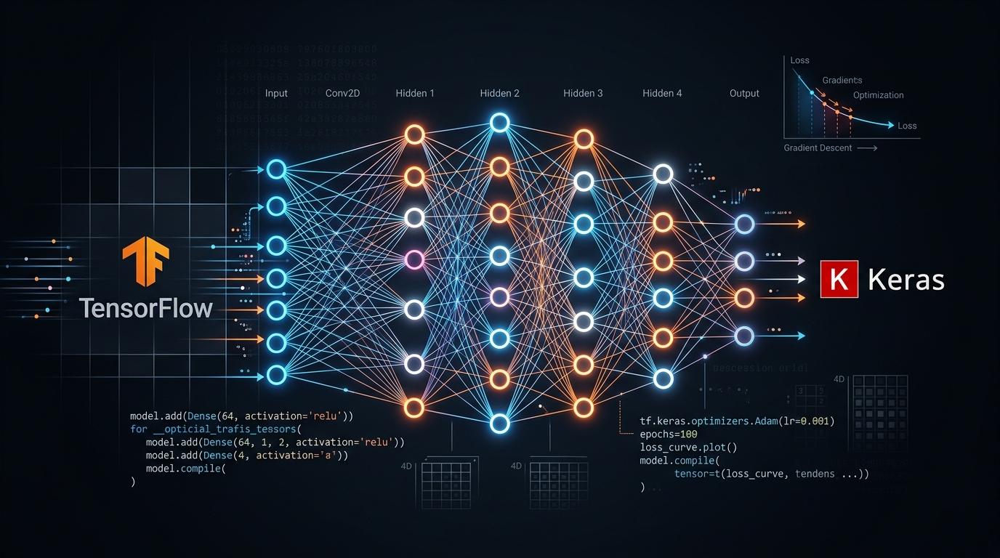

# TensorFlow & Keras



Welcome to the **TensorFlow & Keras** repository! This project contains a detailed Google Colab notebook that demonstrates the core concepts of deep learning using TensorFlow and Keras. It is ideal for beginners and intermediate learners who want hands-on experience with modern neural network tools and workflows.

## Open in Colab

Click the badge below to run the notebook directly in Google Colab:

[](https://colab.research.google.com/drive/1EZd8Sp3GvT1cUAVgTMDkJxMN1xSU3u0u)

---

## Notebook Overview

This notebook covers:

- Introduction to TensorFlow and Keras
- Working with Tensors and Variables
- Building neural networks with Sequential and Functional APIs
- Data input pipelines using `tf.data`
- Model training, evaluation, and prediction
- Handling overfitting and underfitting
- Saving, loading, and reusing models
- Visualizing training with TensorBoard

---

## Repository Structure

```
TensorFlow-Keras/
├── TensorFlow_&_Keras.ipynb   # Main interactive notebook
├── main.py                    # Standalone demo script
├── requirements.txt           # Python dependencies
├── .gitignore                 # Git ignore rules
└── README.md                  # This file
```

---

## Getting Started

### Option 1: Google Colab (Recommended)

1. Click the **"Open in Colab"** badge above.
2. Run the notebook cell by cell.
3. To save your own copy, go to `File > Save a copy in Drive`.

### Option 2: Run Locally

1. Clone the repository:

```bash
git clone https://github.com/Imaad18/TensorFlow-Keras.git
cd TensorFlow-Keras
```

2. Install dependencies:

```bash
pip install -r requirements.txt
```

3. Launch the notebook:

```bash
jupyter notebook "TensorFlow_&_Keras.ipynb"
```

4. Or run the standalone demo:

```bash
python main.py
```

---

## Topics Covered in Detail

| Topic | Description |
|-------|-------------|
| **Tensors & Variables** | Creating, manipulating, and converting tensors and tf.Variables |
| **Sequential API** | Building linear stacks of layers step by step |
| **Functional API** | Creating complex models with shared layers and multiple inputs/outputs |
| **tf.data Pipelines** | Efficient data loading, batching, shuffling, and prefetching |
| **Model Training** | Compiling with loss functions, optimizers, and metrics |
| **Overfitting** | Dropout, L2 regularization, and early stopping techniques |
| **Model Persistence** | Saving and loading models in `.keras` and `SavedModel` formats |
| **TensorBoard** | Visualizing training curves, model graphs, and metrics |

---

## Requirements

- Python 3.9+
- TensorFlow 2.13+
- See `requirements.txt` for full list

---

## License

MIT License — see [LICENSE](LICENSE) for details.
